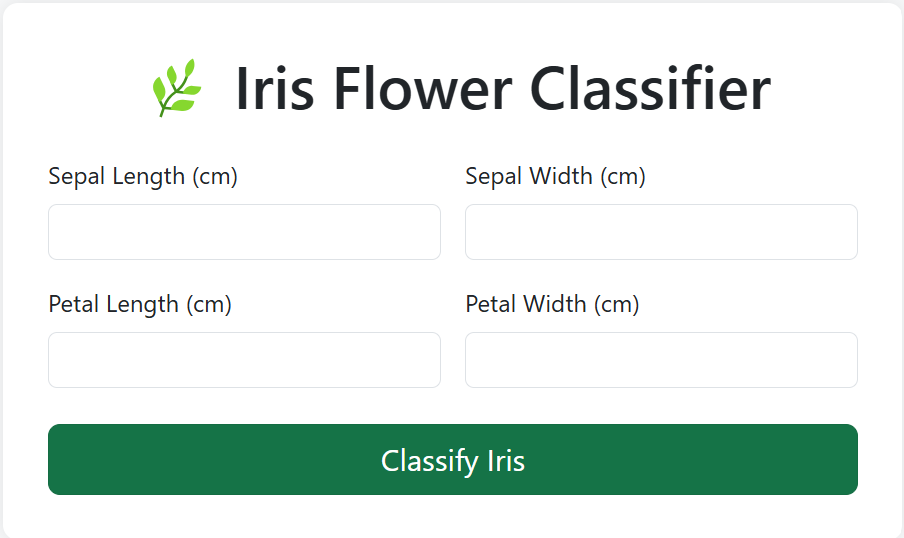
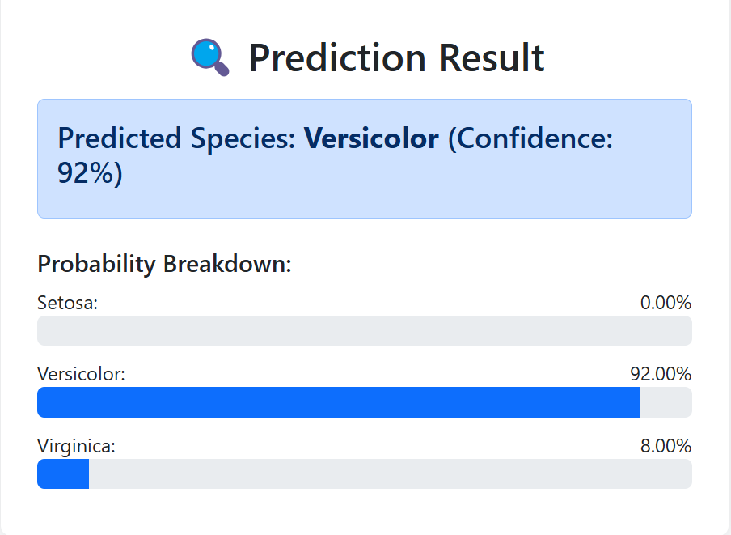

# Iris-Classifier-API 🌸🤖

A Flask API that classifies iris flowers into three species using Random Forest machine learning.


## Features

- 🎯 96%+ accuracy  
- 🌐 REST API endpoint  
- 💻 Beautiful web interface:  

  
*Real-time classification UI*

📊 **Probability Breakdown**:  


## Quick Start

```bash
# 1. Clone repository
git clone https://github.com/yourusername/Iris-Classifier-API.git
cd Iris-Classifier-API

# 2. Install dependencies
pip install -r requirements.txt

# 3. Train model
python train.py

# 4. Run the API
python run.py
